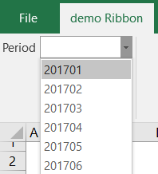
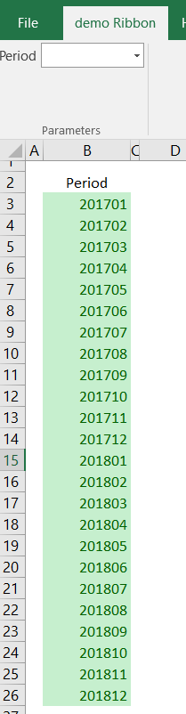
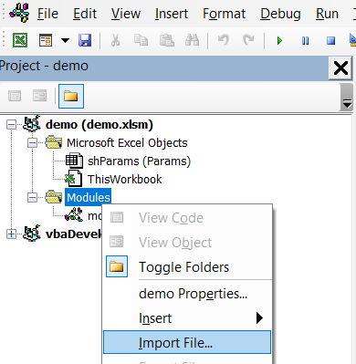
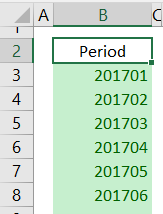
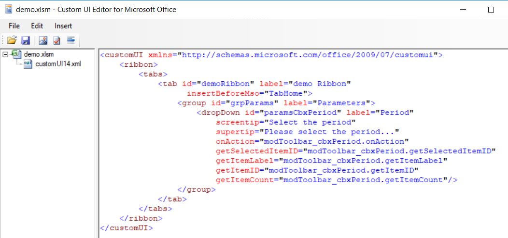
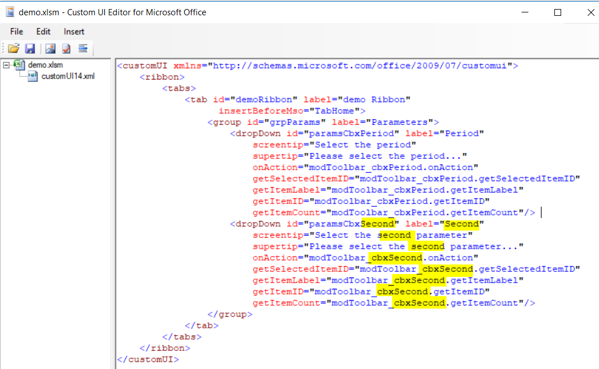

# Excel - VBA - Ribbon - Load dropdown from Excel's range

> How to very easily load an Excel range into the ribbon as a dropdown

The code provided in this repository will show you, very easily, how to use a range of your workbook as source data for a `dropdown` in a `ribbon` as show in the screen capture below :



The list of possible values are taken from a range like here below. That range can be anywhere in your workbook. Most of the time, you'll put such list in a hidden sheet.



By using the VBA code below, everything will be automatic :

* on the opening of the workbook, the ribbon will be initialized with the content of the range,
* if you add / edit / remove values in the list, just save and close the file then reopen it to update the ribbon (you can also add VBA code to `invalidate` the ribbon of course),
* by selecting a value from the dropdown, a name will be created / updated in the workbook so you can use that value in Excel's formulas,
* you'll be able to easily get the selected value in VBA.

## Table of Contents

- [Install](#install)
- [Usage](#usage)
- [Author](#author)
- [License](#license)

## Install

You'll find in the `src` folder of this repository two files, the VBA module (`modToolbar_cbxPeriod.bas`) and the ribbon definition (`ribbon.xml`).

### modToolbar_cbxPeriod.bas

Get a copy of the `modToolbar_cbxPeriod.bas` file and import it into your Excel workbook

1. go to VBE (press `ALT-F11` to open the editor)
2. right-click on the `Modules`, select `Import File...` and import a copy of `modToolbar_cbxPeriod.bas`
	
3. Save and close the file

### Create the list

The `modToolbar_cbxPeriod` module will be used by the ribbon for, a.o.t, retrieve the content of a named range : you then need to create that range.

In your workbook, create a range with the desired values (in our example, a list of period).

For instance :



Give that range a name. In our example, the name is `_rngParamsPeriod`. If you wish to use another, just think to modify the line below from the module

```vbnet
Private Const cRangeName = "_rngParamsPeriod"
```

*Most of times, the range will be in a hidden sheet.*

### ribbon.xml

Get a copy of the `ribbon.xml` content (f.i. copy the content into the clipboard).

1. Start a ribbon editor like, for instance, [Custom UI Editor](http://openxmldeveloper.org/blog/b/openxmldeveloper/archive/2006/05/26/customuieditor.aspx) (that one or any other one)
2. Paste there the code for the ribbon
3. Save and close the file



## Usage

Just open your Excel file and, now, if everything was correctly installed, you'll have a ribbon with a dropdown and your values :


### More dropdowns

If you wish a second, third, ... dropdown, do this :

1. Duplicate the module and give another name (`modToolbar_cbxSecond`, `modToolbar_cbxThird`, ...)
2. Edit the duplicated module and be sure to change the two constants below by giving name names (`_rngParamsSecond` and `_Second`, ...)

```vbnet
Private Const cRangeName = "_rngParamsPeriod"

Private Const cName = "_Period"
```
3. Create new ranges in your Excel sheet with the list of values and give them the name you've mentioned in VBA (like `_rngParamsSecond`)
4. Edit your ribbon and duplicate the dropdown line, example below. Just change hightlight values.



## Author

AVONTURE Christophe

## License

[MIT](LICENSE)